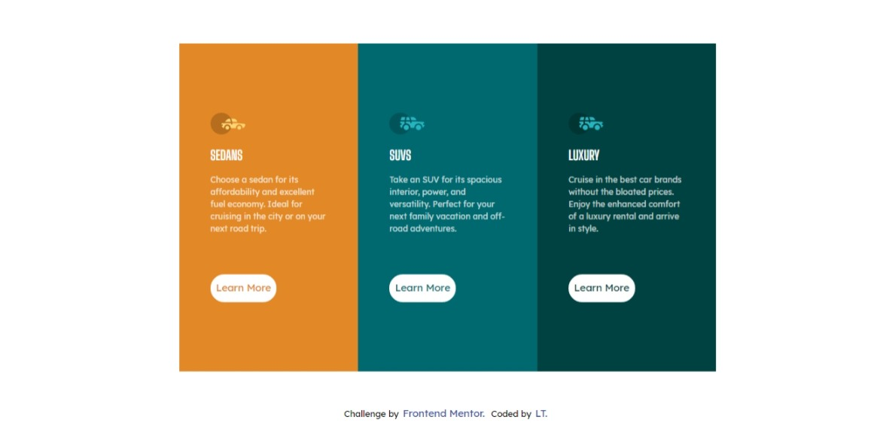
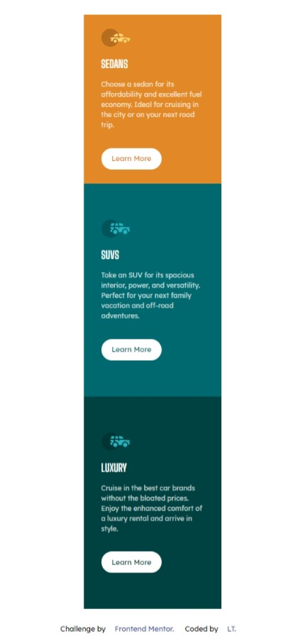

# Frontend Mentor - 3-column preview card component


## Welcome! 👋

Thanks for checking out my front-end coding challenge solution from **Frontend Mentor**.

## Table of contents

- [Overview](#overview)
  - [The challenge](#the-challenge)
  - [Screenshot](#screenshot)
  - [Links](#links)
- [My process](#my-process)
  - [Built with](#built-with)
  - [What I learned](#what-i-learned)
  - [Continued development](#continued-development)
  - [Useful resources](#useful-resources)
- [Author](#author)
- [Acknowledgments](#acknowledgments)

## Overview

## The challenge


Your users should be able to:

- View the optimal layout depending on their device's screen size
- See hover states for interactive elements

### Screenshot





### Links

- Solution URL: [Add solution URL here](https://your-solution-url.com)
- Live Site URL: [Add live site URL here](https://your-live-site-url.com)

## My process

### Built with

- Semantic HTML5 markup
- CSS custom properties
- Flexbox
- Mobile-first workflow

### What I learned

This is my second Frontend Mentor challenge, and I must say that I am glad with the progress I've made thus far, and this challenge was a little bit easier than the first challenge.Completing this challenge has surely gotten me excited for the next challenges I will be doing.

The challenge design was nice and simple - key takeaway here again for this challenge is that mobile-first design really simplifies a lot of the styling. As a developer one needs to be able to pay close attention to the detail of the design spec provided and do absolute best to re-produce the same design.

**My approach**
- Build the mock-up with the mobile-design approach.
- Markout sections on the design that will be broken down into my HTML Markup
- Setup basic styles to be used for my typography.

**My challenges**
- Applying styling to the button links for the hover effect caused my cards height to change when hovering over the buttons.
- Below is the sample code prior to making the changes:
```/*Button styles*/.btn--suvs {color: hsl(184, 100%, 22%); background: #fff;  border-radius: 35px; }```

```/*Hover button styles*/.btn--suvs:hover {background-color: hsl(184, 100%, 22%); color: hsla(0, 0%, 100%, 0.75); border: 3px solid white;}```

The code above caused my cards height to change whenver the button was hovered over - this was because I applied the border on the hover selector.

The solution was to remove the border from the hover selector and add it to the ```.btn--suvs``` selector. I found this solution from [at]grace-snow from another community member who had the same problem.

**Final takeaway**
- Definitely more practice in doing the challenges to get a good hang of building the designs, maybe I can start timing myself once I've completed 3 newbie projects.
- I'm happy on the outcome - there is always room for improvement and I undertake to check other peoples solutions and see how they approached doing this challenge.

### Continued development

- Accessibility
- Media queries 
- CSS Properties: vw, vh etc.

## Author

- Frontend Mentor - [@LT-WebDev](https://www.frontendmentor.io/profile/LT-WebDev)
- Twitter - [@IAM_letlotlo_](https://www.twitter.com/IAM_letlotlo_)


